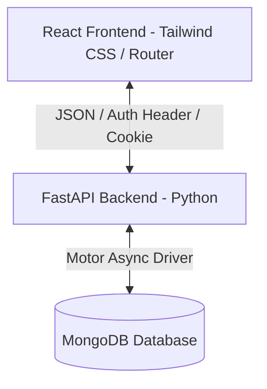

# Premium Admin Panel & POS System Blueprint

This document provides a comprehensive blueprint of the administrative panel and POS (Point of Sale) system designed for **Mian & Sons Hardware**. It details the architecture, folders, page routes, security patterns, data schemas, and role-based permissions. At the end of this document, you will find a **Master Replicator Prompt** that you can copy and paste into another AI session to build a similar system for a different project.

---

## 1. System Architecture Overview

The application is structured as a decoupled client-server architecture:



### Frontend Stack
*   **Core Framework**: React (Single Page Application).
*   **Routing**: React Router DOM (v6) with Protected Routing and dynamic role checks.
*   **State & Contexts**:
    *   `AuthContext`: Handles admin user logins, permissions, token expirations, and session storage.
    *   `CustomerAuthContext`: Handles storefront customers (logins, guest accounts, and credentials).
    *   `ThemeContext`: Controls Light/Dark mode.
    *   `CartContext`, `WishlistContext`, `CompareContext`: Retail shop states.
*   **Styling**: Tailwind CSS + custom premium UI layers (CSS variables, glassmorphism, smooth CSS transitions).
*   **Notifications**: React Toastify (configured with customized premium theme alerts).

### Backend Stack
*   **Core Framework**: FastAPI (Asynchronous Python web framework).
*   **Database**: MongoDB via `motor` (Async driver for Python).
*   **Authentication**: JWT (JSON Web Tokens) with a dual storage option:
    1.  Passed in the standard `Authorization: Bearer <token>` header.
    2.  Stored in secure, `HttpOnly`, `SameSite=Lax` cookies for browser security.
*   **Hashing**: `passlib` with preferred `Argon2` hashing (falling back to PBKDF2/Bcrypt with 72-byte safe truncation for backwards compatibility).
*   **Security Middlewares**:
    *   **CSRF Protection**: Verifies the `Origin` and `Referer` headers against `ALLOWED_ORIGINS` for cookies on all write operations (`POST`, `PUT`, `DELETE`).
    *   **Security Headers**: Adds headers like `X-Frame-Options: DENY`, `X-Content-Type-Options: nosniff`, and `X-XSS-Protection`.
    *   **Rate Limiting**: Custom login request throttling on `/users/login` using client IP tracking.

---

## 2. Directory & Folder Structure

### Frontend Structure
```text
src/
├── App.js                  # Global Router, route protection, and Toast configurations
├── index.js                # Core React mount point
├── App.css / index.css     # Premium Tailwind extensions and theme classes
├── context/
│   ├── AuthContext.js      # Admin state & session expiration rules
│   ├── CustomerAuthContext.js
│   └── ThemeContext.js     # Light/Dark mode switcher
├── layouts/
│   ├── MainLayout.jsx      # Admin panel layout: Collapsible Sidebar + Navbar shell
│   └── AuthLayout.jsx      # Clean login/signup container
├── components/
│   ├── layout/
│   │   ├── Sidebar.jsx     # Navigation sections (Main, Inventory, Billing, Accounts, HR, Admin)
│   │   └── Navbar.jsx      # Search, profile, alerts, and theme toggle
│   └── common/
│       └── ScrollToTop.jsx
├── utils/
│   ├── permissions.js      # UI module-level RBAC configuration
│   └── constants.js        # API base URLs and configs
├── services/
│   ├── api.js              # Central Axios client with auth interceptors
│   └── *Service.js         # Domain services (e.g. productService, salesService)
└── pages/                  # Subdivided by domain module (products, pos, accounts, etc.)
```

### Backend Structure
```text
backend/
├── main.py                 # FastAPI initialization, middlewares, DB connection & route mounting
├── models.py               # Pydantic models for request/response serialization
├── db_config.py            # MongoDB connection pools and database indexes
├── auth_utils.py           # JWT generation and verifying
├── rate_limiter.py         # Request rate throttling
├── audit_logger.py         # Automatic DB logging of write actions
└── routes_*.py             # Decoupled domain routers (e.g., routes_products.py, routes_sales.py)
```

---

## 3. Database Collection Schemas

The system runs on MongoDB with the following entity relationships modeled in Python using Pydantic:

### User (`users`)
Tracks login credentials, profile data, and roles.
*   `username` (str, Unique)
*   `password` (str, hashed)
*   `role` (enum: `'superadmin'`, `'admin'`, `'manager'`, `'cashier'`)
*   `name` (str)
*   `email` (str)

### Product & Category (`products`, `categories`)
Catalog management with stock rules and price dimensions.
*   `name` (str), `code` (str, barcode/sku), `size` (str)
*   `purchasePrice` (float), `salePrice` (float)
*   `category_id` / `brand_id` / `supplier_id` (ObjectIds/Strings)
*   `minStock` (int, for trigger alerts), `maxStock` (int)
*   `branch` (str, branch location mapping), `status` (str, `'Active'`/`'Inactive'`)

### Customer Ledger & Supplier Ledger (`customers`, `suppliers`, `ledgers`)
Tracks client/vendor profiles alongside transaction audit trails.
*   **Balance Fields**: `creditLimit` (float), `openingBalance` (float), `totalPaid` (float), `balanceDue` (float).
*   **Ledger Entries**: Each sale, purchase, or direct cash payment creates a ledger history item recording `debit`, `credit`, `runningBalance`, and `referenceId`.

### Sales & Point of Sale (`orders`)
Records sales transactions from the POS interface.
*   `customer_id` (Optional relationship)
*   `user_id` (The cashier who processed the bill)
*   `items`: List of `{ productId, quantity, unitPrice, discount_id }`
*   `total` (float), `status` (enum: `'pending'`, `'completed'`, `'cancelled'`)
*   `payment`: `{ method: 'Cash'|'Bank', status: 'paid'|'unpaid'|'partial' }`
*   `trackingHistory`: List of changes for order fulfilment.

### Cash Book & Day Book (`transactions`)
Tracks double-entry bookkeeping items.
*   `type` (enum: `'payment'`, `'expense'`, `'income'`, `'salary'`, `'order_payment'`)
*   `amount` (float), `method` (enum: `'cash'`, `'bank_transfer'`)
*   `referenceId` / `referenceType` (Mapping to entity)
*   `date` (ISO date string)

### HR & Payroll (`employees`, `attendance`, `payroll`, `leaves`)
Manages internal staff records.
*   `Employee`: Personal data, designation, salary dimensions (`basicSalary`, `allowances`), and status.
*   `Attendance`: Logs check-in/out timestamps per employee.
*   `Payroll`: Monthly generated salary slips detailing total earnings, deductions, bonuses, and payment status.

---

## 4. Role-Based Access Control (RBAC) Blueprint

The system uses a highly granular RBAC configuration. 

### Roles and Privileges Matrix
*   `superadmin`: Absolute access. Can access settings, view/wipe audit logs, manage branches, and manipulate users.
*   `admin`: Access to all operational modules. Cannot edit system settings, manage users, or view security audit logs.
*   `manager`: Access to sales, inventory, customers, and suppliers (View, Create, Edit). HR modules are restricted to view-only. No access to settings or user creation.
*   `cashier`: Heavily restricted. Can use the POS interface to check out sales and view product prices/customer records. All other sections are blocked.

### Enforcement Mechanism

#### 1. Frontend Router Protection (`App.js`)
Routes are wrapped using `AdminProtectedRoute`:
```jsx
const AdminProtectedRoute = ({ children, permission }) => {
  const { user } = useAuth();
  
  if (!user) {
    return <Navigate to="/admin/login" replace />;
  }

  if (permission) {
    const [module, action] = permission.split('.'); // e.g. "inventory.view"
    const canAccess = hasPermission(user.role, module, action || 'view');
    if (!canAccess) {
      return <Navigate to="/admin/dashboard" replace />;
    }
  }

  return <MainLayout>{children}</MainLayout>;
};
```

#### 2. Frontend Sidebar Filtering (`Sidebar.jsx`)
Menu lists are dynamically generated based on active modules:
```javascript
const canAccess = (module) => hasModuleAccess(userRole, module);
```

#### 3. Backend Endpoint Guards (`auth_utils.py` / Routes)
Endpoints verify permissions inside route handlers using dependency injection:
```python
async def require_permission(module: str, action: str):
    def dependency(current_user: User = Depends(get_current_active_user)):
        if not has_backend_permission(current_user.role, module, action):
            raise HTTPException(status_code=403, detail="Permission denied")
        return current_user
    return dependency
```

---

## 5. Security Protocols & Audit Logs

1.  **Strict Audit Logging (`audit_logger.py`)**:
    Every state-changing API request (`POST`, `PUT`, `DELETE`) writes to the `audit_logs` collection:
    ```json
    {
      "timestamp": "ISO-8601",
      "user": "username",
      "role": "user-role",
      "action": "Updated",
      "module": "Inventory",
      "description": "Adjusted stock for Product X from 10 to 15",
      "ipAddress": "192.168.1.5",
      "isSuspicious": false
    }
    ```
2.  **Cookie-Based CSRF Mitigation**:
    Secure authentication tokens are stored inside browser cookies with properties: `HttpOnly`, `Secure` (for HTTPS), `SameSite=Lax`. Cross-site scripting cannot access the token, and state-changing requests verify origin coordinates dynamically on the server middleware.
3.  **Low Stock Alerts**:
    The database triggers inventory notifications when `quantity` drops below `minStock`. The React client uses an active polling cycle in `Sidebar.jsx` (every 30 seconds) to query `/inventory/alerts` and display real-time badges next to the sidebar icons.

---

## 6. The Master Replicator Prompt

Copy and paste the prompt below into an AI model (like Gemini, Claude, or ChatGPT) to regenerate this exact system for any other project:

```text
Act as a Principal Full-Stack Engineer and Architect. I want you to design and build a robust, premium Admin Panel and POS (Point-of-Sale) management system for a new project. 

The implementation must strictly adhere to the following architecture, structures, and security patterns:

### 1. Technology Stack
- **Frontend**: React (Single Page Application using Vite or Create React App), Tailwind CSS, React Router DOM (v6), React-Toastify. Dark/Light Theme support via context.
- **Backend**: FastAPI (Python), Motor (Async MongoDB Driver), PyJWT.
- **Database**: MongoDB (indexes, transactions, aggregation pipelines).

### 2. Core Layout & Navigation
- Provide a dual-layout system: `AuthLayout` for signups/logins, and `MainLayout` for the authenticated admin dashboard.
- The `MainLayout` must feature a Collapsible Sidebar with navigation items grouped into logical sections:
  1. Main: Dashboard (visual stats, charts)
  2. Inventory: Products, Categories, Stock Alerts, Damaged Stock
  3. Sales & Billing: POS/Billing Interface, Sales Log, Returns, Discounts
  4. Purchases: Purchase Orders, Suppliers, Supplier Ledger
  5. Customers: Customer Profiles, Customer Ledger (Credit/Debit tracking)
  6. Accounts: Cash Book, Day Book, Expenses, Payments logs
  7. HR & Staff: Employee Directory, Daily Attendance, Payroll slip generator, Leave management
  8. Administration: User accounts management, Branch routing, Warranties claims, Audit logs, General Settings
- Implement a real-time polling check (every 30 seconds) to display notifications/alerts counts as badges on the sidebar items.

### 3. Role-Based Access Control (RBAC)
- Support 4 roles: `superadmin` (full permissions), `admin` (operational access, no security/users), `manager` (read-write for inventory/sales, read-only for HR, no admin settings), `cashier` (only POS interface and viewing prices).
- Configure a permission schema mapping modules to allowed actions (view, create, edit, delete, export).
- Protect routes on the frontend using a wrapper component checking permissions. Enforce permission guards on the backend via endpoint dependencies.

### 4. Backend & Database Security
- Write a unified MongoDB connection manager that seeds default users (superadmin, admin, manager, cashier) and ensures compound database indexes on critical fields (e.g. usernames, product codes, transaction dates).
- Store passwords using Argon2 or PBKDF2 hashing.
- Manage authentication using JWTs returned on login. Additionally, save the JWT in an HttpOnly, Secure, SameSite=Lax cookie.
- Build a custom middleware in FastAPI to:
  1. Guard write operations (POST, PUT, DELETE) by checking the Origin/Referer header against a list of Allowed CORS Origins (CSRF check).
  2. Append safety headers: X-Frame-Options (DENY), X-Content-Type-Options (nosniff), X-XSS-Protection.
- Add an audit logger middleware/helper that records every database mutation to an `audit_logs` collection detailing timestamp, user, role, IP, action, module, and description.

### 5. Data Entities & Schemas
Generate database models (or Pydantic serialization schemas) for:
- User (username, role, email, password)
- Product (name, code/SKU, purchasePrice, salePrice, minStock, branch, status)
- Category (name, description, parent_id)
- Order/Sale (customer_id, cashier_user_id, items: list of products/qty/prices, total, paymentStatus, paymentMethod)
- Ledger (debit, credit, runningBalance, transactionReference)
- Transaction (amount, type: payment/expense/income, method: cash/bank, referenceId)
- Employee (name, designation, salary, allowances, status, branch)
- Attendance, Payroll, and Leaves records
- Warranty claim logs (sale_id, start_date, end_date, status, serial_no)

Start by proposing the backend FastAPI setup (`main.py`, `models.py`, `auth_utils.py`) and then design the frontend navigation, permissions context (`permissions.js`), layout shell, and POS views. Apply premium glassmorphic styling, HSL variables for dark mode transitions, and visual charts.
```
