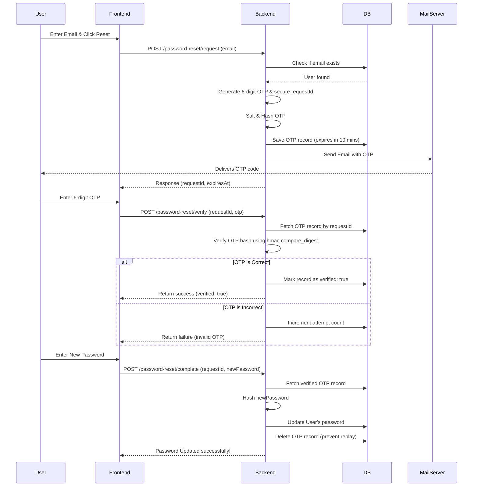

# Secure OTP Password Reset Mechanism

This guide details a production-grade, highly secure OTP (One-Time Password) generation, delivery, and verification system. It is designed to resist brute-force guessing, timing attacks, and replay attacks.

---

## 1. Flow Diagram



---

## 2. Database Schema (MongoDB / NoSQL)

```json
{
  "requestId": "qW_48-JjJ39x0N2f928zV...", // Secure random URL-safe token
  "email": "user@domain.com",              // Target account email
  "otpHash": "a1b2c3d4e5f6g7h8...",       // SHA256(salt + ":" + otp)
  "otpSalt": "9f8e7d6c5b4a...",            // Random hex token generated for this attempt
  "createdAt": "ISODate()",                // Creation timestamp
  "expiresAt": "ISODate()",                // Expiry timestamp (typically 10 minutes)
  "attempts": 0,                           // Unsuccessful verification attempts (Max: 5)
  "verified": false                        // Becomes true upon successful verification
}
```

---

## 3. Implementation Code (Python / FastAPI)

Here is a clean template that can be ported to any modern Python framework:

```python
import os
import asyncio
import secrets
import hashlib
import hmac
import smtplib
import logging
from email.message import EmailMessage
from datetime import datetime, timedelta
from typing import Optional
from pydantic import BaseModel, EmailStr

# Configurations
OTP_EXPIRY_SECONDS = 600  # 10 minutes
MAX_OTP_ATTEMPTS = 5

logger = logging.getLogger("otp_reset")

# Requests Models
class RequestResetPayload(BaseModel):
    email: EmailStr

class VerifyOtpPayload(BaseModel):
    requestId: str
    otp: str

class CompleteResetPayload(BaseModel):
    requestId: str
    newPassword: str

# Helpers
def generate_secure_otp() -> str:
    # Generates a random 6-digit code: "100000" to "999999"
    return f"{secrets.randbelow(900000) + 100000:06d}"

def generate_request_id() -> str:
    return secrets.token_urlsafe(24)

def generate_salt() -> str:
    return secrets.token_hex(16)

def hash_otp(otp: str, salt: str) -> str:
    payload = f"{salt}:{otp}".encode("utf-8")
    return hashlib.sha256(payload).hexdigest()

def send_otp_email(recipient: str, otp: str):
    smtp_host = os.getenv("SMTP_HOST", "smtp.gmail.com")
    smtp_port = int(os.getenv("SMTP_PORT", "587"))
    smtp_user = os.getenv("SMTP_USER", "")
    smtp_pass = os.getenv("SMTP_PASS", "")
    smtp_from = os.getenv("SMTP_FROM", smtp_user)

    msg = EmailMessage()
    msg["Subject"] = "Your Verification OTP"
    msg["From"] = smtp_from
    msg["To"] = recipient
    msg.set_content(f"Your one-time password code is: {otp}\n\nThis code is valid for 10 minutes.")

    with smtplib.SMTP(smtp_host, smtp_port, timeout=15) as server:
        server.starttls()
        if smtp_user and smtp_pass:
            server.login(smtp_user, smtp_pass)
        server.send_message(msg)

# FastAPI Endpoints
from fastapi import APIRouter, HTTPException, Depends

router = APIRouter(prefix="/api/auth")

@router.post("/reset-request")
async def request_reset(payload: RequestResetPayload, db: any = Depends()):
    # 1. Normalize Email
    email = payload.email.strip().lower()

    # 2. Check if user exists
    user = await db.users.find_one({"email": email})
    if not user:
        # Security Note: Returning 200 or 404 depends on user privacy requirements.
        # Returning a generic message protects against username enumeration.
        raise HTTPException(status_code=404, detail="Email address not found.")

    # 3. Create tokens
    otp = generate_secure_otp()
    salt = generate_salt()
    request_id = generate_request_id()
    now = datetime.utcnow()
    expires_at = now + timedelta(seconds=OTP_EXPIRY_SECONDS)

    otp_record = {
        "requestId": request_id,
        "email": email,
        "otpHash": hash_otp(otp, salt),
        "otpSalt": salt,
        "createdAt": now,
        "expiresAt": expires_at,
        "attempts": 0,
        "verified": False
    }

    # 4. Save to database & send email
    try:
        await db.otp_resets.insert_one(otp_record)
        # Dispatch email asynchronously to prevent endpoint blocking
        await asyncio.to_thread(send_otp_email, email, otp)
    except Exception as e:
        await db.otp_resets.delete_one({"requestId": request_id})
        logger.error(f"Failed to process OTP request: {e}")
        raise HTTPException(status_code=500, detail="Mail server configuration error.")

    return {
        "success": True,
        "requestId": request_id,
        "expiresAt": int(expires_at.timestamp())
    }

@router.post("/reset-verify")
async def verify_otp(payload: VerifyOtpPayload, db: any = Depends()):
    record = await db.otp_resets.find_one({"requestId": payload.requestId})
    if not record:
        raise HTTPException(status_code=400, detail="Invalid reset session.")

    # Check Expiry
    if datetime.utcnow() > record["expiresAt"]:
        await db.otp_resets.delete_one({"requestId": payload.requestId})
        raise HTTPException(status_code=400, detail="OTP code has expired.")

    # Check Rate Limit Attempts
    if record["attempts"] >= MAX_OTP_ATTEMPTS:
        await db.otp_resets.delete_one({"requestId": payload.requestId})
        raise HTTPException(status_code=400, detail="Too many failed attempts. Session locked.")

    # Compare Hash
    input_hash = hash_otp(payload.otp, record["otpSalt"])
    if not hmac.compare_digest(input_hash, record["otpHash"]):
        # Increment attempts on failure
        await db.otp_resets.update_one(
            {"requestId": payload.requestId},
            {"$inc": {"attempts": 1}}
        )
        raise HTTPException(status_code=400, detail="Invalid OTP code.")

    # Mark as verified
    await db.otp_resets.update_one(
        {"requestId": payload.requestId},
        {"$set": {"verified": True}}
    )
    return {"success": True}

@router.post("/reset-complete")
async def complete_reset(payload: CompleteResetPayload, db: any = Depends()):
    record = await db.otp_resets.find_one({"requestId": payload.requestId})
    if not record or not record.get("verified"):
        raise HTTPException(status_code=400, detail="Invalid or unverified reset session.")

    # Hash new password
    hashed_password = hashlib.sha256(payload.newPassword.encode()).hexdigest()

    # Update User Profile
    await db.users.update_one(
        {"email": record["email"]},
        {"$set": {"passwordHash": hashed_password}}
    )

    # Immediately delete reset record to prevent replay
    await db.otp_resets.delete_one({"requestId": payload.requestId})

    return {"success": True, "message": "Password changed successfully."}
```

---

## 4. Key Security Practices

1. **Timing Attack Protection (`hmac.compare_digest`)**: 
   Standard string comparisons (`==`) terminate early upon finding the first non-matching character, allowing attackers to measure processing times to guess the hash. `compare_digest` takes a constant execution time regardless of the content.
2. **Replay Prevention**: 
   The OTP session is immediately deleted (`delete_one`) from the database upon completing the password update. This prevents attackers from reusing a verified session.
3. **Session Identification via `requestId`**:
   The frontend never uses the user's email during verification or confirmation calls. Instead, the backend references a randomized UUID/Token (`requestId`). This prevents user enumeration or interception of username data.
4. **Brute Force Rate Limiting**:
   The code tracks the `attempts` count in the database. When it reaches 5, the session is deleted/locked immediately.
